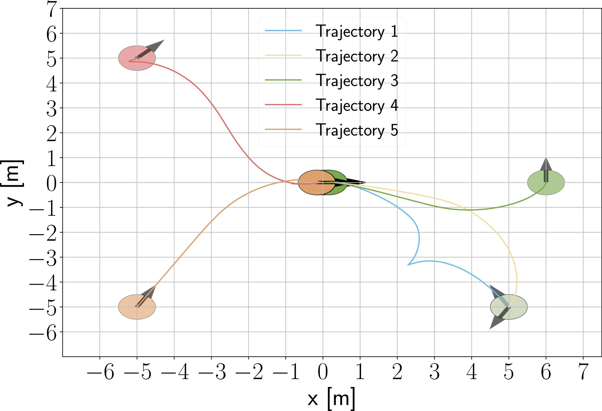

# Hamiltonian-based Neural ODE Networks on the SE(3) Manifold For Dynamics Learning and Control from Point Clouds

This repository contains the code accompanying our paper submission https://arxiv.org/pdf/2309.09163.pdf
The aim of the project is to learn the hamiltonian dynamics of a differential drive robot from point cloud measurements taken from the robot. Additionally we demonstrate that the learned model is capable to accurately track trajectories in case of deviation from ideal differential drive constraints like one wheel not able to generate as much traction as  the second wheel. 

For more details , please visit our project website: https://altwaitan.github.io/DLFO/ 
## Setup
First of all, clone the repository:
```commandline
git clone https://github.com/ExistentialRobotics/Differential-Drive-Hamiltonian-NeuralODE.git
```
To replicate results of the paper, we first need to setup a conda environment which can be set up by first installing Anaconda from https://www.anaconda.com/download and then installing the conda environment from the file provided as follows:


```
conda env create -f hamnode.yaml
```

Once installation is done, activate the environment using:
```commandline
conda activate hamnode
```

Add the root repository path to the ```PYTHONPATH``` environment variable as follows:
```commandline
export PYTHONPATH=$PYTHONPATH:~/Differential-Drive-Hamiltonian-NeuralODE/
```

Another path that we need to add is the ```lib``` folder of the conda environment we are using to ```LD_LIBRARY_PATH```
for using ```open3d``` for point cloud related processing. This can be done as follows:
```commandline
export LD_LIBRARY_PATH=$LD_LIBRARY_PATH:~/anaconda3/envs/hamnode/lib
```

## Collecting the point cloud dataset
We use a simulator called SAPIEN(https://sapien.ucsd.edu/) to create a simulation environment of our differential drive robot in a suitable environment allowing us to save point cloud observations from a simulated camera on top of the robot.
To run the simulator and collect point cloud data, run the following script:
```commandline
mkdir -p ModelTraining/jackal/data/PointClouds  # Point clouds from sim are saved here
cd JackalSim
python3 jackal_collect_pointcloud.py
```

The robot moves to a set of predefined points (defined in Lines 407-409) and saves point clouds at each step of the trajectory.
Once the data collection is done, we need to process the saved point clouds to get the correspondence dataset between each successive point cloud within the trajectories that will be used for the model training process. This is done by running the following script:
```commandline
cd ../ # Make sure you are in the root project directory
python3 ModelTraining/jackal/FGRCorrespondenceSet.py
```

This saves the desired dataset at ```ModelTraining/jackal/data/PointCloudData.npy```
We will load this dataset for training the Hamiltonian Model.

## Model training
The Hamiltonian Neural ODE architecture is defined in ```se3hamneuralode``` directory. For more details of the architecture details and training process, please refer to our project website https://altwaitan.github.io/DLFO/ and our paper https://arxiv.org/pdf/2309.09163.pdf

To start the training process from the point cloud dataset, the following script can be invoked from the root project directory:
```commandline
python3 ModelTraining/jackal/train_jackal_from_point_clouds.py --learn_rate 5e-4 --total_steps 200 --M1_known 1/0 --M2_known 1/0  
```
where ```M1_known, M2_known``` having value 1 means we are training the model with known mass, inertia assumption whereas taking a value of 0 means we assume those to be unknown.

The trained model is saved every 100 iterations in ```ModelTraining/jackal/data/PointCloudTrainedModels/```

## Model evaluation
Once the model is trained, the evaluation can be done by invoking the following script:
```commandline
python3 ModelTraining/jackal/analyze_jackal.py
```
The code will load the saved model, training data and output plots for the training and testing loss, the SO(3) constraints along the trajectories, the learned mass, inertial matrices, the potential energy, the dissipation matrices and the control input matrix. 

We provide a pre trained model in ```ModelTraining/jackal/data/PointCloudTrainedModels/TrainedModels/``` which can be directly loaded for analyzing, or you can load your own model by changing the location of the saved model in lines 31, 33.
Refer to our paper for detailed plots and explanations. 

## Energy Based Controller for differential drive robot using learned Hamiltonian Model
Using the learned model, we are able to construct an energy based controller with a desired Lyapunov function that enables our controller to achieve pose stabilization and trajectory tracking. 
To evaluate the controller constructed using the learned model, run the script:
```commandline
python3 ModelTraining/jackal/controller_test.py --checkpoint <Input Model Checkpoint, or don't provide it which will use the last saved Model>
```

You can provide different starting poses for the robot by changing the ```x_start, y_start, yaw_start``` values in lines 306-308.

## Results
The performance of the controller from learned model is attached below: 

### Pose stabilization plots
<p align='center'>

</p>

### Example 1 : Pose stabilization from x=6, y=-6, yaw=-1.571rad to x=0, y=0, yaw=0
<p align='center'>

</p>

### Example 2 : Pose stabilization from x=-5, y=5, yaw=-0.785rad to x=0, y=0, yaw=0
<p align='center'>

</p>


